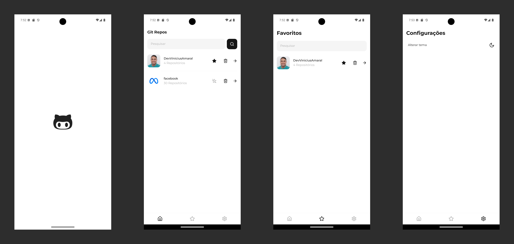
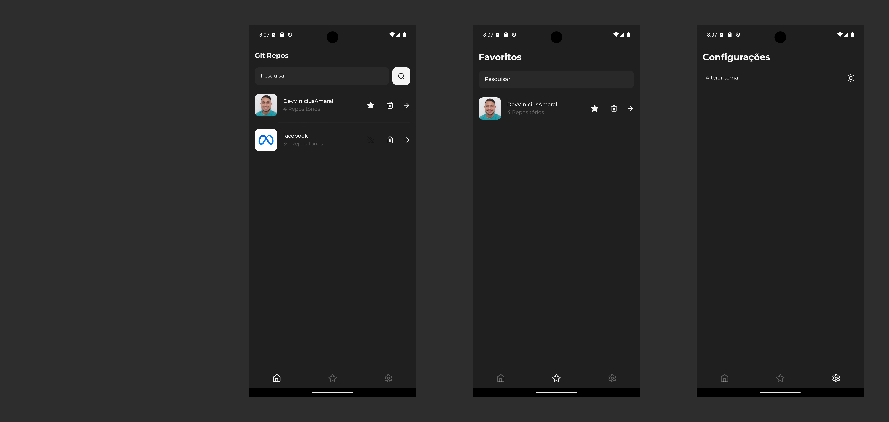

# Git Repos
> Aplicação mobile de listagem e pesquisa de repositórios do github

## Light


## Dark


## Instalação
Faça o clone do repositório para sua máquina local
```Bash
git clone git@github.com:DevViniciusAmaral/git-repos.git
```

Instale as dependências
```Bash
yarn install
```

Execute os comandos
```Bash
yarn start
yarn android || yarn ios
```